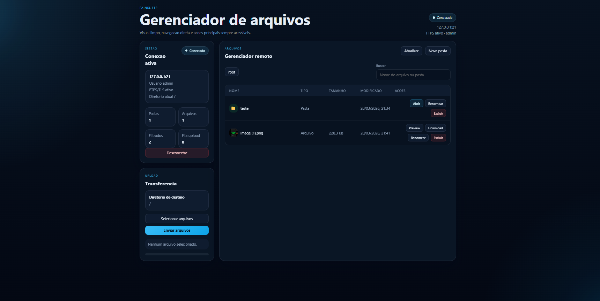

# FTP Lab Manager

Aplicacao full stack para gerenciamento de arquivos via navegador, usando **Python** no servidor FTP/FTPS, **Node.js** como camada de API e **React** na interface.

O projeto foi pensado para transformar operacoes classicas de FTP em uma experiencia mais moderna, visual e acessivel, sem depender de um cliente desktop tradicional. E um projeto interessante para portifolio porque conecta protocolo de rede, backend, frontend e preocupacoes de seguranca em uma unica solucao.



## Visao geral

O **FTP Lab Manager** permite autenticar em um servidor FTP/FTPS e executar as principais operacoes de gerenciamento de arquivos direto pelo navegador:

- login com host, porta, usuario e senha
- navegacao por diretorios remotos
- upload de multiplos arquivos com feedback visual
- download de arquivos
- criacao de pastas
- renomeacao e exclusao de itens
- preview de imagens e arquivos de texto
- suporte a **FTPS explicito (TLS)**

## Destaques do projeto

- **Arquitetura em 3 camadas**: interface React, API Node.js e servidor FTP/FTPS em Python
- **Experiencia web amigavel**: interface inspirada em file managers, com foco em clareza e produtividade
- **Seguranca com FTPS**: criptografia via TLS e geracao automatica de certificado autoassinado
- **Sessao web desacoplada**: autenticacao FTP validada no backend e mantida em sessao HTTP
- **Manipulacao real de arquivos**: listagem, envio, download, preview, renomeacao e remocao
- **Configuracao centralizada**: variaveis compartilhadas por Node.js e Python via `.env`

## Stack utilizada

### Frontend

- React 19
- Vite
- CSS puro

### Backend web

- Node.js
- Express
- basic-ftp
- Multer

### Servidor de arquivos

- Python
- pyftpdlib
- pyOpenSSL

## Arquitetura

```text
Navegador
   |
   v
React + Vite
   |
   v
API Node.js (Express)
   |
   v
Cliente FTP/FTPS (basic-ftp)
   |
   v
Servidor Python (pyftpdlib + TLS)
   |
   v
Sistema de arquivos em backend/arquivos
```

### Papel de cada camada

- **React**: entrega a interface de login, navegacao, upload e acoes sobre arquivos
- **Node.js**: expoe rotas HTTP, valida sessao, gerencia uploads temporarios e conversa com o servidor FTP
- **Python**: sobe o servidor FTP/FTPS real, controla autenticacao e opera no diretorio raiz dos arquivos

## Funcionalidades implementadas

- autenticacao com credenciais do servidor
- persistencia de sessao por cookie HTTP-only
- listagem ordenada de arquivos e diretorios
- criacao de pasta remota
- renomeacao de arquivos e pastas
- exclusao de arquivos e diretorios
- upload multiplo com barra de progresso
- download com resposta em stream
- preview de imagens
- leitura de arquivos de texto no navegador
- logs no backend Node e no servidor Python
- endpoint de health check

## Decisoes tecnicas relevantes

- Cada operacao protegida abre uma nova conexao FTP/FTPS no backend Node. Isso reduz problemas com conexoes longas ou quebradas e combina melhor com o modelo stateless do HTTP.
- O frontend nao fala FTP diretamente. Toda a comunicacao passa pela API Node, que centraliza validacao, sessao e tratamento de erros.
- Quando o FTPS esta habilitado, o servidor Python gera automaticamente um certificado local para facilitar testes e demonstracoes.
- A configuracao do sistema fica centralizada no `.env`, permitindo trocar host, porta, usuario, senha e modo seguro sem alterar o codigo.

## Estrutura do projeto

```text
FTP/
|- backend/
|  |- arquivos/        # raiz dos arquivos servidos por FTP
|  |- certs/           # certificados FTPS
|  |- uploads/         # temporarios de upload
|  |- server.py        # servidor FTP/FTPS em Python
|  |- web.js           # API e servidor web em Node.js
|  |- load_env.py
|  |- loadEnv.js
|- frontend/
|  |- src/
|  |- index.html
|  |- vite.config.mjs
|- prints/
|  |- img.png
|- .env
|- .env.example
|- package.json
|- README.md
```

## Como executar localmente

### 1. Instale as dependencias do Node.js

```bash
npm install
```

### 2. Instale as dependencias do Python

```bash
python -m pip install pyftpdlib pyOpenSSL
```

### 3. Gere o build do frontend

```bash
npm run build
```

### 4. Inicie o servidor FTP/FTPS

```bash
npm run start:ftp
```

### 5. Inicie a API e a interface web

```bash
npm start
```

### 6. Acesse no navegador

```text
http://localhost:3000
```

## Variaveis de ambiente

Arquivo base:

```env
FTP_HOST=127.0.0.1
FTP_PORT=21
FTP_ADMIN_NAME=admin
FTP_ADMIN_PASSWORD=123
FTPS_ENABLED=true
FTP_PASSIVE_START=30000
FTP_PASSIVE_END=30010
WEB_PORT=3000
```

### Principais configuracoes

- `FTP_HOST`: endereco do servidor FTP/FTPS
- `FTP_PORT`: porta do servico
- `FTP_ADMIN_NAME`: usuario principal
- `FTP_ADMIN_PASSWORD`: senha principal
- `FTPS_ENABLED`: ativa ou desativa a camada TLS
- `FTP_PASSIVE_START` e `FTP_PASSIVE_END`: faixa de portas passivas
- `WEB_PORT`: porta da interface web

## Credenciais padrao

```text
Usuario: admin
Senha:   123
Porta:   21
```

## Pontos que este projeto demonstra

- integracao entre linguagens diferentes no mesmo sistema
- consumo de protocolo legado por meio de uma interface web moderna
- manipulacao de arquivos com upload, download e streaming
- separacao clara entre UI, API e camada de servico
- configuracao compartilhada entre runtimes diferentes
- aplicacao pratica de FTPS para adicionar seguranca ao FTP tradicional

## Melhorias futuras

- autenticacao com multiplos usuarios e niveis de permissao
- drag and drop para upload
- historico de operacoes
- pagina de logs e monitoramento
- deploy conteinerizado com Docker

## Para LinkedIn

Se voce quiser apresentar este projeto no LinkedIn, um bom resumo seria:

> Desenvolvi uma aplicacao full stack para gerenciamento de arquivos via FTP/FTPS com interface web em React, API em Node.js e servidor em Python. O projeto cobre autenticacao, upload, download, preview de arquivos, organizacao por diretorios e criptografia com TLS, mostrando na pratica a integracao entre frontend, backend e protocolos de rede.

## Autor

Projeto publicado em: [github.com/Nymeds/FTP](https://github.com/Nymeds/FTP)
